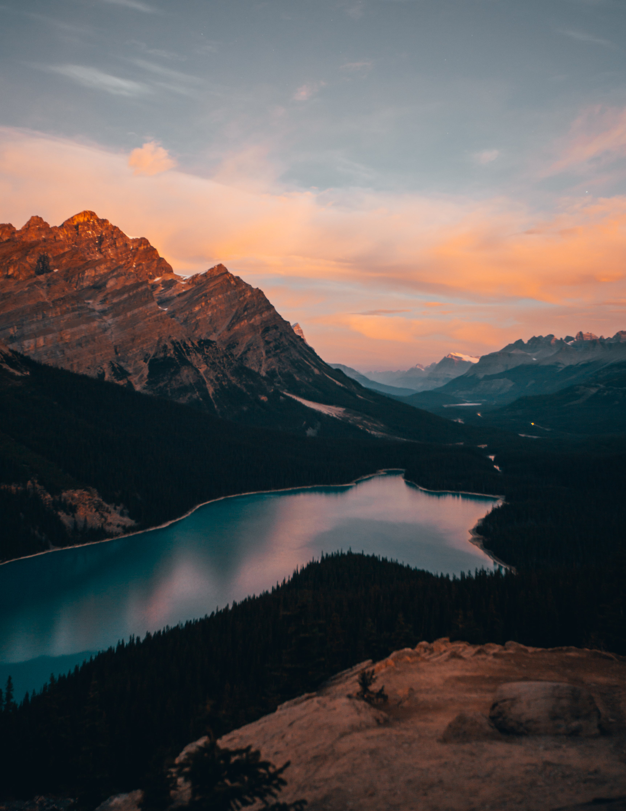
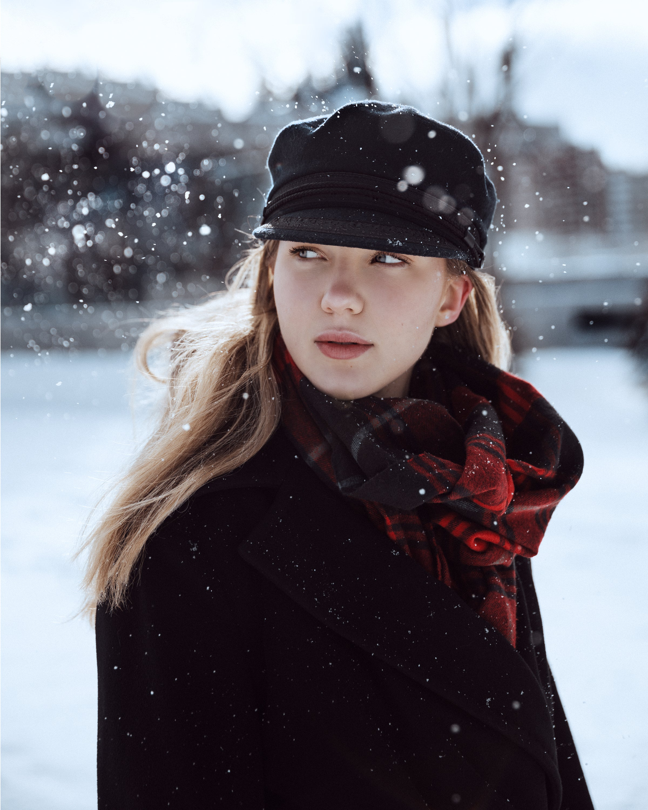

<html lang="en">
<head>
    <meta charset="UTF-8">
    <meta name="viewport" content="width=device-width, initial-scale=1.0">
    <title>Photography Portfolio</title>
    <link rel="preconnect" href="https://fonts.googleapis.com">
    <link rel="preconnect" href="https://fonts.gstatic.com" crossorigin>
    <link href="https://fonts.googleapis.com/css2?family=Playfair+Display:ital,wght@0,400..900;1,400..900&display=swap" rel="stylesheet">
    
</head>
<body>
    

        <header>
            <h1>Photography Portfolio</h1>
        </header>

        <section id="my-work">
            <h2>My Work</h2>
            

                

                    
                    
Landscapes

                

                

                    
                    
Portraits

                

                

                    
                    
Flora

                

                

                    
                    
Wildlife

                

            

        </section>

        <section id="about-me">
            <h2>About Me</h2>
            
Hi, I’m Janet Scholten, a photographer with a passion for capturing the beauty of nature and exploring new perspectives. Through my lens, I strive to highlight the unique moments and details that often go unnoticed. Whether it's a sweeping landscape or a simple portrait, my goal is to inspire others to see the world in fresh and exciting ways.

        </section>

        <section id="contact">
            <h2>Contact</h2>
            
If you are interested in working with me or have any questions, feel free to contact me at:

            
Email: <a href="mailto:jscholtenphotography@gmail.com" style="color: #fff;">jscholten@hotmail.ca</a>

            
Phone: <a href="tel:(604) 217-1751" style="color: #fff;">(604) 217-1751</a>

        </section>

        <section id="social-media">
            <h2>Follow Me</h2>
            

                <a href="https://www.instagram.com/yourprofile" target="_blank">Instagram</a> |
                <a href="https://www.facebook.com/yourprofile" target="_blank">Facebook</a>
            

        </section>

        <footer>
            
&copy; 2024 Janet Scholten. All rights reserved.

        </footer>
    

</body>
</html>
